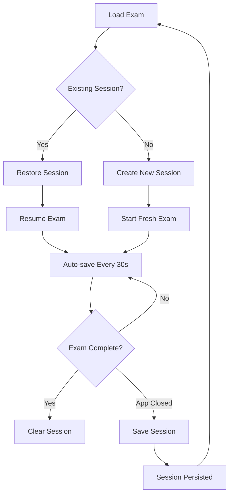

# Exam Session Management Implementation

## Overview

This document describes the exam session management system that allows students to resume exams even after closing the application. The system automatically saves exam progress and restores it when the app is reopened.

## Features

### 🔄 **Automatic Session Management**
- **Auto-Creation**: Sessions are automatically created when an exam is loaded
- **Auto-Save**: Progress is saved every 30 seconds during exam execution
- **Auto-Resume**: Sessions are automatically detected and restored on app restart
- **Auto-Cleanup**: Expired sessions (24+ hours old) are automatically removed

### 💾 **Persistent State Storage**
- Current question index and navigation state
- All answered questions with timestamps
- Remaining exam time
- Exam start/submission status
- Last activity timestamp for expiry detection

### 🛡️ **Data Integrity & Security**
- Session validation on load to prevent corruption
- Automatic cleanup of corrupted session files
- Secure local storage in user data directory
- Unique session IDs to prevent conflicts

## Architecture

### Core Components

1. **Session Interfaces** (`crypto.ts`)
   ```typescript
   interface ExamSession {
     sessionId: string;
     examId: string;
     studentId: string;
     examStartedAt: string;
     lastActivity: string;
     currentQuestionIndex: number;
     timeRemaining: number;
     answers: Record<number, Answer>;
     examStarted: boolean;
     examSubmitted: boolean;
     autoSaveEnabled: boolean;
   }
   ```

2. **Session Management Methods** (`crypto.ts`)
   - `createExamSession()` - Create new session
   - `updateExamSession()` - Update existing session
   - `validateSession()` - Validate session integrity
   - `isSessionExpired()` - Check session expiry

3. **IPC Handlers** (`electron.events.ts`)
   - `create-exam-session` - Create new session
   - `save-exam-session` - Save session to disk
   - `load-exam-session` - Load session from disk
   - `update-exam-session` - Update session state
   - `get-student-sessions` - Get all sessions for student
   - `clear-exam-session` - Delete session
   - `cleanup-expired-sessions` - Cleanup expired sessions

4. **UI Integration** (`ExamPage.tsx`)
   - Automatic session initialization on exam load
   - Real-time session updates during exam
   - Session restoration on app restart
   - Visual feedback for session resumption

### Session Lifecycle



## File Storage

### Directory Structure
```
userData/
├── exam-sessions/
│   ├── {sessionId1}.json
│   ├── {sessionId2}.json
│   └── ...
├── submissions/
│   └── ... (encrypted submissions)
└── preloaded-exams/
    └── ... (exam data)
```

### Session File Format
```json
{
  "sessionId": "abc123...",
  "examId": "exam_001",
  "studentId": "student_123",
  "examStartedAt": "2025-07-13T10:00:00.000Z",
  "lastActivity": "2025-07-13T10:15:30.000Z",
  "savedAt": "2025-07-13T10:15:30.000Z",
  "version": "1.0",
  "currentQuestionIndex": 5,
  "timeRemaining": 3600,
  "answers": {
    "1": {
      "questionId": 1,
      "answer": "Sample answer",
      "timeSpent": 120
    }
  },
  "examStarted": true,
  "examSubmitted": false,
  "autoSaveEnabled": true
}
```

## Implementation Details

### Auto-Save Mechanism
```typescript
// Auto-save every 30 seconds
useEffect(() => {
  if (!currentSession?.autoSaveEnabled || examSubmitted) {
    return;
  }

  const interval = setInterval(autoSaveSession, 30000);
  return () => clearInterval(interval);
}, [autoSaveSession, currentSession?.autoSaveEnabled, examSubmitted]);
```

### Session Detection & Restoration
```typescript
const initializeSession = async (examId: string, studentId: string) => {
  // Check for existing sessions
  const existingSessions = await window.electron.getStudentSessions(studentId);
  const examSession = existingSessions.find(
    session => session.examId === examId && !session.examSubmitted
  );

  if (examSession) {
    // Restore existing session
    setCurrentQuestionIndex(examSession.currentQuestionIndex);
    setTimeRemaining(examSession.timeRemaining);
    setAnswers(examSession.answers);
    setExamStarted(examSession.examStarted);
    // ...
  } else {
    // Create new session
    const newSession = await window.electron.createExamSession(examId, studentId);
    // ...
  }
};
```

### Session Expiry & Cleanup
- **Expiry Time**: 24 hours from last activity
- **Automatic Cleanup**: Run on session load and via manual cleanup
- **Cleanup Trigger**: Can be called manually from Session Manager UI

## User Experience

### Visual Feedback
1. **Loading State**: Special message when resuming session
   ```
   "Resuming exam session..."
   "📝 We found your previous session and are restoring your progress"
   ```

2. **Seamless Restoration**: All exam state restored exactly as left
   - Current question displayed
   - All previous answers preserved
   - Timer continues from where left off
   - Navigation state maintained

### Error Handling
- **Corrupted Sessions**: Automatically deleted and new session created
- **Expired Sessions**: Cleaned up on detection
- **Missing Sessions**: New session created automatically
- **Save Failures**: Graceful degradation with error logging

## Management Tools

### Session Manager UI
- **Filter by Student**: View sessions for specific students
- **Session Details**: View progress, timing, and metadata
- **Manual Cleanup**: Remove expired/corrupted sessions
- **Real-time Status**: Current session states and progress

### Development Tools
- Session validation and integrity checking
- Manual session creation/deletion
- Progress monitoring and debugging
- Storage usage analysis

## API Reference

### Electron APIs
```typescript
// Create new session
window.electron.createExamSession(examId: string, studentId: string): Promise<ExamSession>

// Save session
window.electron.saveExamSession(sessionData: ExamSession): Promise<boolean>

// Load session
window.electron.loadExamSession(sessionId: string): Promise<SessionSaveData | null>

// Update session
window.electron.updateExamSession(sessionId: string, updates: Partial<ExamSession>): Promise<ExamSession>

// Get student sessions
window.electron.getStudentSessions(studentId: string): Promise<SessionSaveData[]>

// Clear session
window.electron.clearExamSession(sessionId: string): Promise<boolean>

// Cleanup expired
window.electron.cleanupExpiredSessions(): Promise<number>
```

## Configuration

### Session Settings
- **Auto-save Interval**: 30 seconds (configurable)
- **Expiry Time**: 24 hours (configurable)
- **Auto-cleanup**: Enabled by default
- **Validation**: Strict validation on load

### Storage Limits
- **File Size**: Typically < 10KB per session
- **Cleanup Frequency**: On app start and manual trigger
- **Retention**: Until expired or exam submitted

## Benefits

### For Students
- **Continuity**: Never lose progress due to app crashes or closures
- **Flexibility**: Can pause and resume exams as needed
- **Peace of Mind**: Automatic backup of all answers and progress
- **Seamless Experience**: Transparent session management

### For Administrators
- **Reliability**: Robust session management with error recovery
- **Monitoring**: Track student progress and session usage
- **Maintenance**: Automatic cleanup and storage management
- **Debug Tools**: Comprehensive session management interface

## Future Enhancements

### Planned Features
1. **Session Synchronization**: Sync sessions across multiple devices
2. **Session Analytics**: Track usage patterns and statistics
3. **Advanced Cleanup**: Configurable retention policies
4. **Session Migration**: Import/export sessions for backup
5. **Conflict Resolution**: Handle multiple sessions for same exam

### Performance Optimizations
1. **Batch Operations**: Group session updates for efficiency
2. **Compression**: Compress session data for storage
3. **Lazy Loading**: Load sessions on demand
4. **Cache Management**: In-memory caching for active sessions

## Troubleshooting

### Common Issues
1. **Session Not Resuming**: Check session expiry and validation
2. **Auto-save Not Working**: Verify electron availability and permissions
3. **Storage Full**: Run cleanup for expired sessions
4. **Corrupted Sessions**: Automatic detection and cleanup

### Debug Steps
1. Check Session Manager for active sessions
2. Verify file permissions in userData directory
3. Run session validation tests
4. Check electron console for error messages

## Conclusion

The exam session management system provides a robust, user-friendly solution for maintaining exam continuity across app sessions. With automatic save/restore, comprehensive error handling, and intuitive management tools, it ensures students never lose progress while providing administrators with powerful monitoring and maintenance capabilities.
